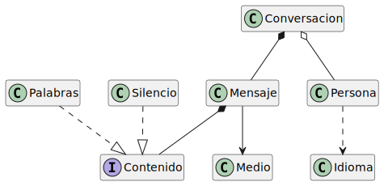

| Relación | Clases | Justificación |
| :--- | :--- | :--- |
| **AGREGACIÓN** | Conversación y Persona (Emisor/Receptor) | Los emisores y receptores existen independientemente del hilo de chat |
| | | La conversación no los crea, únicamente mantiene referencias a ellos |
| **COMPOSICIÓN** | Mensaje y Contenido (Palabras/Silencio) | El contenido no puede existir sin el mensaje y su ciclo de vida está ligado a este |
| | | Si el mensaje se destruye, las palabras o el silencio que contiene también |
| **COMPOSICIÓN** | Conversación y Mensaje | La conversación es dueña absoluta de los mensajes que se intercambian |
| | | No existen mensajes huérfanos fuera del ámbito de una conversación |
| **ASOCIACIÓN** | Mensaje y Medio | Relación duradera donde el mensaje conoce el canal por el que fue enviado |
| | | El mensaje mantiene la referencia estructural al medio durante su existencia |
| **USO** | Persona (Emisor) e Idioma | El emisor utiliza temporalmente el idioma solo para traducir su idea a palabras |
| | | Utiliza el idioma exclusivamente durante la ejecución del método de emisión |
| | | No mantiene una referencia al idioma una vez generado el contenido del mensaje |

## Implementación de código

La implementación se ha organizado siguiendo una arquitectura que separa la lógica de los participantes, el transporte de la información y la naturaleza del mensaje.

### 1. Núcleo de la Conversación y Dominio
Esta capa gestiona la orquestación de los intercambios y la persistencia del historial.

```java
public class Conversacion {
    private List<Persona> participantes;
    private List<Mensaje> historial;
    private Medio medioActual;

    public Conversacion(List<Persona> participantes, Medio medio) {
        this.participantes = new ArrayList<>(participantes);
        this.medioActual = medio;
        this.historial = new ArrayList<>();
    }

    public void realizarIntercambio(Persona emisor, String idea, Idioma idioma) {
        Contenido contenido = emisor.emitirMensaje(idea, idioma);
        Mensaje nuevoMsj = new Mensaje(contenido, this.medioActual);
        this.historial.add(nuevoMsj);
    }
}

public class Mensaje {
    private Contenido cargaUtil;
    private Medio canal;

    Mensaje(Contenido contenido, Medio medio) {
        this.cargaUtil = contenido;
        this.canal = medio;
    }
}
```

## Actores y Herramientas (Uso y Colaboración)

Define a los sujetos de la comunicación y los elementos transitorios como el idioma.

```java
public class Persona {
    private String nombre;

    public Persona(String nombre) {
        this.nombre = nombre;
    }

    public Contenido emitirMensaje(String idea, Idioma idioma) {
        if (idea == null || idea.isEmpty()) {
            return new Silencio(5);
        }
        String textoTraducido = idioma.procesar(idea);
        return new Palabras(textoTraducido);
    }
}

public class Idioma {
    private String nombre;

    public Idioma(String nombre) {
        this.nombre = nombre;
    }

    public String procesar(String texto) {
        return "[Idioma: " + nombre + "] " + texto;
    }
}

public class Medio {
    private String tipo;

    public Medio(String tipo) {
        this.tipo = tipo;
    }
}
```
## 3. Abstracción del Contenido (Polimorfismo)

Implementación del contrato de contenido para soportar diferentes tipos de carga útil.

```java
public interface Contenido {
}

class Palabras implements Contenido {
    private String texto;
    public Palabras(String texto) { this.texto = texto; }
}

class Silencio implements Contenido {
    private int duracion;
    public Silencio(int duracion) { this.duracion = duracion; }
}
```

# Diagrama de clases
### 
