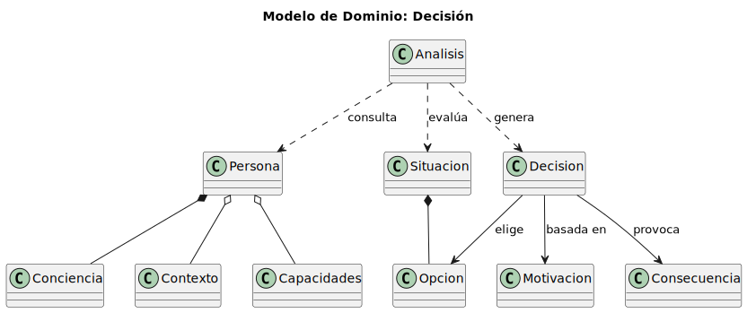
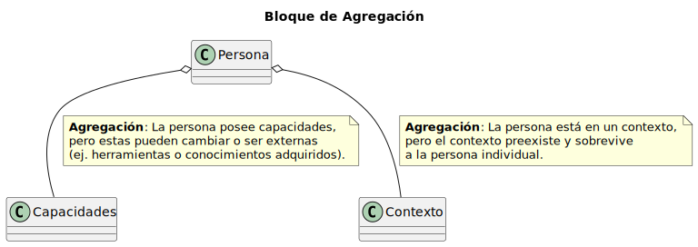
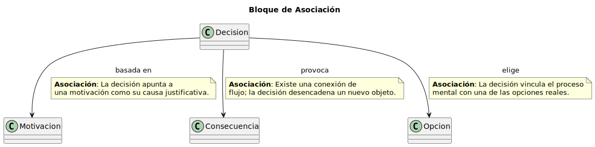
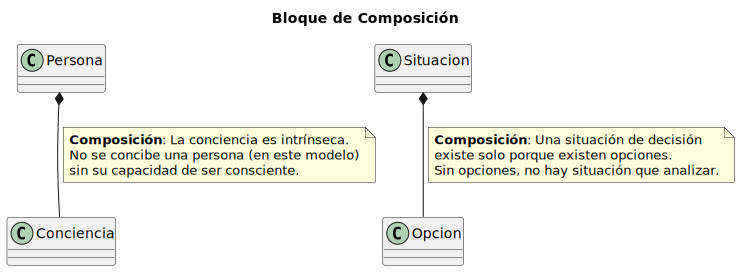
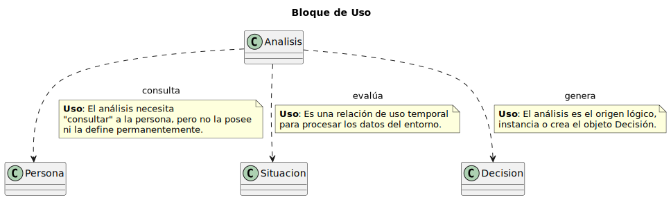

# Diagramas SVG

---

    <a href="images/" style="padding: 8px 16px; background: #455a64; color: #fff; border-radius: 5px; text-decoration: none;">Imágenes y modelo UML</a>
    <a href="docs/" style="padding: 8px 16px; background: #1976d2; color: #fff; border-radius: 5px; text-decoration: none;">Docs</a>
    <a href="src/" style="padding: 8px 16px; background: #757575; color: #fff; border-radius: 5px; text-decoration: none;">Código fuente</a>

---

## Decisión

[Ver puml](../modelosUML/Decision.puml)

---

## Agregación

[Ver puml](../modelosUML/Agregacion.puml)

## Asociación

[Ver puml](../modelosUML/Asociacion.puml)

## Composición

[Ver puml](../modelosUML/Composicion.puml)

## Uso

[Ver puml](../modelosUML/Uso.puml)
