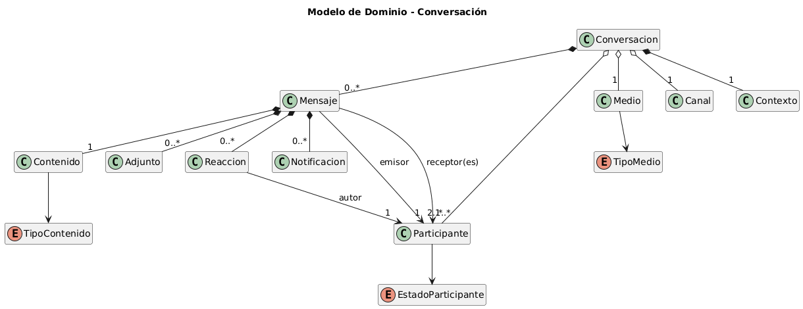

# Composición y Agregación

## Concepto: Conversación

Se eligió modelar una **Conversación** porque es un concepto que tiene de todo: partes que no pueden existir solas y partes que viven por su cuenta.

> Iteración anterior: [v1](docs/v1.md)

---

## Diagrama de Dominio



> Fuente PlantUML: [`modelosUML/DiagramaDeDominio_Conversacion.puml`](modelosUML/DiagramaDeDominio_Conversacion.puml)

---

## ¿Cómo distinguir una de otra?

La pregunta clave es: **si se destruye el todo, ¿la parte tiene sentido por sí sola?**

|                  | Composición ◆                                  | Agregación ◇                                         |
| ---------------- | ---------------------------------------------- | ---------------------------------------------------- |
| **Dependencia**  | La parte **no existe** sin el todo             | La parte **existe independientemente**               |
| **Creación**     | El todo **crea** la parte internamente         | La parte se **crea fuera** y se pasa como referencia |
| **Destrucción**  | Si el todo se destruye, las partes **también** | Si el todo se destruye, las partes **sobreviven**    |
| **Compartición** | La parte pertenece a **un solo** todo          | La parte puede pertenecer a **múltiples** todos      |

---

## Enumeraciones del dominio

Antes de entrar en las relaciones, conviene definir los tipos que restringen los valores válidos dentro del modelo. Estos enums no son composición ni agregación: son **clasificaciones** que las entidades usan para describirse.

### `TipoMedio`

Define el tipo de medio por el que se desarrolla la conversación.

```java
public enum TipoMedio {
    ORAL,
    ESCRITO,
    DIGITAL,
    PRESENCIAL
}
```

### `TipoContenido`

Define el formato del contenido de un mensaje.

```java
public enum TipoContenido {
    TEXTO,
    AUDIO,
    IMAGEN,
    VIDEO
}
```

### `EstadoParticipante`

Refleja el estado actual de un participante dentro de una conversación.

```java
public enum EstadoParticipante {
    ACTIVO,
    INACTIVO,
    AUSENTE
}
```

---

## Composición ◆ — _"La parte NO existe sin el todo"_

### ¿Por qué estos elementos son composición?

Pensándolo desde la vida real:

- Un **Mensaje** no tiene sentido flotando solo. Siempre pertenece a una conversación concreta (`0..*`). Si se borra la conversación, los mensajes desaparecen con ella.
- El **Contenido** de un mensaje (el texto, la imagen) no existe separado del mensaje. Cada mensaje tiene exactamente **un** contenido (`1`), y este no tiene identidad propia fuera de él. Además, su formato se restringe mediante `TipoContenido`.
- Un **Adjunto** está atado al mensaje donde se envió (`0..*`). No se encuentra suelto en ningún lado.
- Una **Reacción** solo existe en el contexto de un mensaje específico (`0..*`). Adicionalmente, cada reacción tiene un **autor** que es un `Participante` — esto es una dependencia (flecha), no composición: la reacción sabe quién la hizo, pero no posee al participante.
- Una **Notificación** se genera porque existe un mensaje (`0..*`). Sin ese mensaje, la notificación no tiene razón de ser.
- El **Contexto** (tema, motivo de la conversación) es propio de esa conversación (`1`). No se comparte con otras.

### ¿Cómo se refleja esto en el código?

En composición se observa que:

1. El constructor de la parte es **package-private** — solo el todo puede crearla.
2. La parte se **crea dentro** del todo, no se recibe como parámetro.
3. Si el todo se destruye, **destruye las partes en cascada**.
4. Se retornan listas **inmutables** para proteger la composición.

### `Conversacion *-- "0..*" Mensaje`

La conversación es la que crea el mensaje. Nadie de fuera puede hacer `new Mensaje()` directamente:

**Mensaje.java**

```java
public class Mensaje {

    private final String id;
    private final Contenido contenido;
    private final Participante emisor;
    private final List<Participante> receptores;
    private final List<Adjunto> adjuntos = new ArrayList<>();
    private final List<Reaccion> reacciones = new ArrayList<>();
    private final List<Notificacion> notificaciones = new ArrayList<>();

    // Package-private: solo Conversacion puede crear Mensajes
    Mensaje(String cuerpo, TipoContenido tipo, Participante emisor, List<Participante> receptores) {
        this.id = UUID.randomUUID().toString();
        this.contenido = new Contenido(cuerpo, tipo);  // composición: nace aquí
        this.emisor = emisor;                           // dependencia: solo referencia
        this.receptores = receptores;                   // dependencia: solo referencia
    }

    public Adjunto agregarAdjunto(String nombre, byte[] datos) {
        Adjunto adjunto = new Adjunto(nombre, datos);
        adjuntos.add(adjunto);
        return adjunto;
    }

    public Reaccion agregarReaccion(String tipo, Participante autor) {
        Reaccion reaccion = new Reaccion(tipo, autor);
        reacciones.add(reaccion);
        return reaccion;
    }

    void destruir() {
        adjuntos.clear();
        reacciones.clear();
        notificaciones.clear();
    }
}
```

**Conversacion.java**

```java
public class Conversacion {

    private final List<Mensaje> mensajes = new ArrayList<>();

    // El mensaje se crea DENTRO — la conversación decide cuándo nace
    public Mensaje agregarMensaje(String cuerpo, TipoContenido tipo,
                                  Participante emisor, List<Participante> receptores) {
        Mensaje mensaje = new Mensaje(cuerpo, tipo, emisor, receptores);
        mensajes.add(mensaje);
        return mensaje;
    }

    // Lista inmutable: nadie de fuera puede modificar los mensajes
    public List<Mensaje> obtenerMensajes() {
        return Collections.unmodifiableList(mensajes);
    }

    // Si la conversación muere, los mensajes mueren con ella
    public void destruir() {
        for (Mensaje mensaje : mensajes) {
            mensaje.destruir();
        }
        mensajes.clear();
    }
}
```

### `Mensaje *-- "1" Contenido`

El contenido nace con el mensaje. No tiene vida propia. Su formato se clasifica con `TipoContenido`:

```java
public class Contenido {

    private final String cuerpo;
    private final TipoContenido tipo;

    // Package-private
    Contenido(String cuerpo, TipoContenido tipo) {
        this.cuerpo = cuerpo;
        this.tipo = tipo;
    }
}
```

### `Mensaje *-- "0..*" Adjunto`

Un adjunto no existe sin su mensaje. Se crea dentro de él:

```java
public class Adjunto {

    private final String nombreArchivo;
    private final byte[] datos;

    // Package-private
    Adjunto(String nombreArchivo, byte[] datos) {
        this.nombreArchivo = nombreArchivo;
        this.datos = datos;
    }
}
```

### `Mensaje *-- "0..*" Reaccion`

Una reacción pertenece a un mensaje (composición), pero **conoce** a su autor a través de una dependencia hacia `Participante`:

```java
public class Reaccion {

    private final String tipo;
    private final Participante autor;  // dependencia, no composición

    // Package-private
    Reaccion(String tipo, Participante autor) {
        this.tipo = tipo;
        this.autor = autor;
    }
}
```

> La relación `Reaccion --> Participante : autor` es una **dependencia**: la reacción referencia al participante que la creó, pero no lo posee ni lo destruye.

### `Conversacion *-- "1" Contexto`

El contexto es propio de una sola conversación. Se crea internamente:

```java
public class Contexto {

    private final String tema;
    private final String motivo;

    // Package-private
    Contexto(String tema, String motivo) {
        this.tema = tema;
        this.motivo = motivo;
    }
}
```

```java
public class Conversacion {

    private Contexto contexto;

    public void establecerContexto(String tema, String motivo) {
        this.contexto = new Contexto(tema, motivo);  // nace aquí
    }

    public void destruir() {
        this.contexto = null;  // muere con la conversación
    }
}
```

---

## Agregación ◇ — _"La parte EXISTE independientemente del todo"_

### ¿Por qué estos elementos son agregación?

Aquí la lógica cambia completamente:

- Un **Participante** (una persona) existe antes, durante y después de cualquier conversación. Juan no desaparece porque se borre un chat. Además, puede estar en muchas conversaciones a la vez (`2..*`). Su estado se describe con `EstadoParticipante`.
- Un **Medio** (digital, presencial, telefónico) es un concepto que existe por sí solo (`1`). Muchas conversaciones pueden usar el mismo medio. Su naturaleza se clasifica con `TipoMedio`.
- Un **Canal** (WhatsApp, email, presencial) también existe independientemente (`1`). Si se elimina una conversación, WhatsApp sigue existiendo.

### ¿Cómo se refleja esto en el código?

En agregación se observa que:

1. El constructor de la parte es **public** — cualquiera puede crearla.
2. La parte se **crea fuera** del todo y se pasa como **referencia**.
3. Si el todo se destruye, solo se **elimina la referencia** (la parte sigue viva).
4. La parte puede ser **compartida** entre múltiples todos.

### `Conversacion o-- "2..*" Participante`

El participante se crea fuera y se le pasa a la conversación. La conversación no lo posee, solo lo referencia. El participante tiene un estado que puede cambiar:

**Participante.java**

```java
public class Participante {

    private final String id;
    private final String nombre;
    private final String email;
    private EstadoParticipante estado;

    // Publico: un participante existe por si mismo
    public Participante(String id, String nombre, String email) {
        this.id = id;
        this.nombre = nombre;
        this.email = email;
        this.estado = EstadoParticipante.ACTIVO;
    }

    public void cambiarEstado(EstadoParticipante nuevoEstado) {
        this.estado = nuevoEstado;
    }

    public EstadoParticipante getEstado() {
        return estado;
    }
}
```

**Conversacion.java**

```java
public class Conversacion {

    private final List<Participante> participantes = new ArrayList<>();

    // Se recibe desde fuera, no se crea aqui
    public void agregarParticipante(Participante participante) {
        participantes.add(participante);
    }

    public void removerParticipante(Participante participante) {
        participantes.remove(participante);
    }

    // Al destruir, solo se suelta la referencia. El participante sigue vivo.
    public void destruir() {
        participantes.clear();
    }
}
```

### `Conversacion o-- "1" Medio`

El medio existe por sí solo. Varias conversaciones pueden compartir el mismo. Su naturaleza se clasifica con `TipoMedio`:

```java
public class Medio {

    private final String nombre;
    private final TipoMedio tipo;

    public Medio(String nombre, TipoMedio tipo) {
        this.nombre = nombre;
        this.tipo = tipo;
    }
}
```

```java
public class Conversacion {

    private Medio medio;

    public void asignarMedio(Medio medio) {
        this.medio = medio;
    }

    // Solo se suelta la referencia
    public void destruir() {
        this.medio = null;
    }
}
```

### `Conversacion o-- "1" Canal`

El canal existe independientemente. Varias conversaciones pueden usar el mismo canal:

```java
public class Canal {

    private final String id;
    private final String nombre;
    private final String categoria;

    public Canal(String id, String nombre, String categoria) {
        this.id = id;
        this.nombre = nombre;
        this.categoria = categoria;
    }
}
```

```java
public class Conversacion {

    private Canal canal;

    public void asignarCanal(Canal canal) {
        this.canal = canal;
    }

    public void destruir() {
        this.canal = null;
    }
}
```

---

## Poniéndolo todo junto

Este ejemplo muestra cómo se ve la diferencia en la práctica. Lo interesante es observar qué ocurre al destruir la conversación:

```java
public class Main {
    public static void main(String[] args) {

        // ══════════════════════════════════════════════
        // AGREGACION: estas entidades ya existen por su cuenta
        // ══════════════════════════════════════════════
        Participante juan = new Participante("P001", "Juan", "juan@email.com");
        Participante maria = new Participante("P002", "Maria", "maria@email.com");
        Medio internet = new Medio("Internet", TipoMedio.DIGITAL);
        Canal whatsapp = new Canal("CH001", "WhatsApp", "Mensajeria");

        // ══════════════════════════════════════════════
        // Crear conversacion y AGREGAR entidades que ya existian
        // ══════════════════════════════════════════════
        Conversacion conv = new Conversacion("C001", "Proyecto");
        conv.agregarParticipante(juan);    // ◇ solo una referencia
        conv.agregarParticipante(maria);   // ◇ solo una referencia
        conv.asignarMedio(internet);       // ◇ solo una referencia
        conv.asignarCanal(whatsapp);       // ◇ solo una referencia

        // ══════════════════════════════════════════════
        // COMPOSICION: estas entidades nacen DENTRO de la conversacion
        // ══════════════════════════════════════════════
        conv.establecerContexto("Sprint Planning", "Reunion");
        Mensaje msg = conv.agregarMensaje("Hola equipo", TipoContenido.TEXTO,
                                          juan, List.of(maria));
        msg.agregarAdjunto("doc.pdf", new byte[1024]);
        msg.agregarReaccion("like", maria);  // la reaccion conoce a su autor

        // ══════════════════════════════════════════════
        // El participante tiene estado
        // ══════════════════════════════════════════════
        juan.cambiarEstado(EstadoParticipante.AUSENTE);

        // ══════════════════════════════════════════════
        // Juan puede estar en OTRA conversacion al mismo tiempo
        // ══════════════════════════════════════════════
        Conversacion otra = new Conversacion("C002", "Chat");
        otra.agregarParticipante(juan);    // el MISMO Juan
        otra.asignarMedio(internet);       // el MISMO Medio

        // ══════════════════════════════════════════════
        // DESTRUIR la primera conversacion
        // ══════════════════════════════════════════════
        conv.destruir();

        // Composicion: Mensajes, Contexto, Contenido, Adjuntos, Reacciones, Notificaciones -> DESTRUIDOS
        // Agregacion:  Juan, Maria, Internet, WhatsApp -> SIGUEN VIVOS

        System.out.println(juan.getEstado()); // AUSENTE — sigue existiendo
        System.out.println(internet);         // sigue existiendo
        System.out.println(otra);             // Juan sigue aqui
    }
}
```

---

## Cambios respecto a la iteración anterior

| Aspecto                     | v1                             | v2                                                                  |
| --------------------------- | ------------------------------ | ------------------------------------------------------------------- |
| **Enumeraciones**           | No se definían                 | Se incluyen `TipoMedio`, `TipoContenido` y `EstadoParticipante`     |
| **Multiplicidades**         | No se indicaban                | Se reflejan en los títulos y explicaciones (`0..*`, `1`, `2..*`)    |
| **Reacción - Autor**        | No se mencionaba               | Se explica la dependencia `Reaccion --> Participante : autor`       |
| **Estado del Participante** | Sin estado                     | Se modela con `EstadoParticipante` y métodos de cambio              |
| **Canal**                   | Sin snippet de código          | Se incluye la clase `Canal` con su ejemplo de agregación            |
| **Mensaje completo**        | Fragmentado en varios snippets | Se presenta la clase `Mensaje` con todas sus composiciones internas |
| **Receptores**              | No se consideraban             | `Mensaje --> Participante : receptor(es)` con `1..*`                |
| **Diagrama UML**            | Solo referencia a imagen       | Se enlaza al archivo `.puml` fuente                                 |

---

## Conclusión

```
COMPOSICION ◆ (rombo negro)              AGREGACION ◇ (rombo blanco)
─────────────────────────────             ─────────────────────────────
La parte NO tiene sentido sola          La parte EXISTE por si misma
Se crea DENTRO del todo                 Se crea FUERA y se pasa
Se destruye CON el todo                 SOBREVIVE al todo
Pertenece a UN solo todo                Puede estar en VARIOS todos
```

La clave está en hacerse la pregunta: **¿esta parte puede existir sin el todo?** Si la respuesta es *no*, es composición. Si la respuesta es *sí*, es agregación. El código simplemente refleja esa decisión conceptual.
