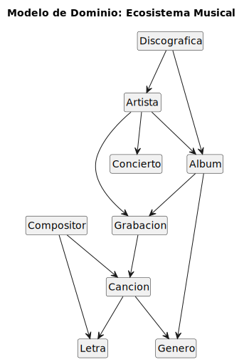

## 1. IDENTIFICACIÓN DE CLASES

En esta iteración del ecosistema musical, se han definido las siguientes clases principales:

* **Artista:** El eje central del modelo; gestiona su carrera, finanzas y equipo.
* **Miembro:** Cada uno de los músicos que integran la banda del artista.
* **Género:** Define el estilo musical (Rock, Trap, Pop, etc.).
* **Canción:** La unidad creativa básica.
* **Álbum:** Colección de canciones agrupadas para su venta o reproducción.
* **Gira:** Proyecto que engloba una serie de presentaciones en vivo.
* **Concierto:** Cada una de las fechas individuales dentro de una gira.
* **Discográfica:** Empresa que ofrece soporte comercial y distribución.
* **Contrato:** Documento legal que vincula al artista con una discográfica.
* **Instrumento:** Objeto utilizado por el artista para la ejecución musical.

---

## 2. RELACIONES ENTRE CLASES 

| Tipo de Relación | Clases Involucradas | Justificación del Modelo |
| :--- | :--- | :--- |
| **COMPOSICIÓN** | `Artista` y `Miembro` | Los miembros son parte integral de la banda. Si el artista (como entidad de grupo) desaparece, la formación de miembros se disuelve. |
| **COMPOSICIÓN** | `Artista` y `Género` | El género es un atributo esencial que define la identidad del artista desde su creación. |
| **AGREGACIÓN** | `Artista` y `Álbum` | El artista posee álbumes, pero estos pueden seguir existiendo en el catálogo musical incluso si el artista se retira. |
| **AGREGACIÓN** | `Artista` y `Canción` | Las canciones pueden existir como singles independientes o dentro de un álbum, sobreviviendo a la carrera del artista. |
| **AGREGACIÓN** | `Gira` y `Concierto` | Una gira se compone de múltiples fechas. Si la gira se cancela, los conciertos individuales pierden su contexto programado. |
| **ASOCIACIÓN** | `Artista` y `Discográfica` | Relación profesional entre dos entidades independientes que colaboran bajo objetivos comunes. |
| **ASOCIACIÓN** | `Artista` y `Contrato` | Vínculo legal que especifica términos de pago y duración de la relación comercial. |
| **USO** | `Artista` e `Instrumento` | El artista utiliza el instrumento para ensayar o grabar, pero no es una parte biológica o estructural del mismo. |

---

## 3. MODELADO DEL ECOSISTEMA MUSICAL

| Diagrama |
|-------|
| |
| [Código UML](modelosUML/dominio.puml)|

| Traducción a código parcial |
|-------|
| [Código](src/)|