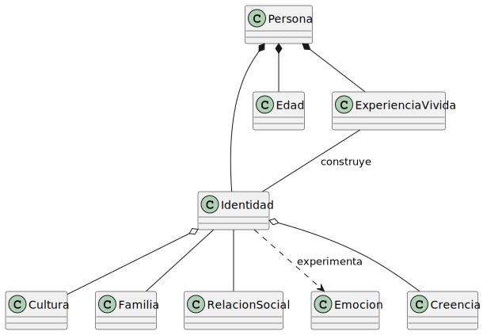
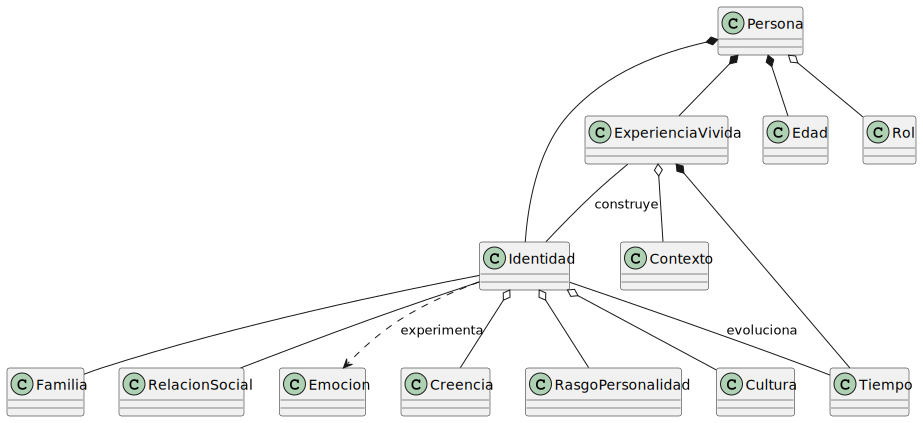

# Identidad

## Primera iteración

Es la primera iteración, por ende, se intentaron buscar la mayoría de clases, pero que creería que aún faltan, sin embargo no sabría como describirlas o como llamarlas, por ende, busqué la manera de hacerlo lo más específico posible.

|
|:-:
|[Código fuente](./modelosUML/primeraIteracion.puml)

## Explicación de relaciones

- Persona y Cultura: La cultura puede existir independiente de una persona y una persona puede existir independiente de una cultura. (Una no depende de la otra)
- Persona y Familia: Una persona pertenece/está relacionada con una familia
- Persona y RelacionSocial: Una persona mantiene relaciones sociales
- Persona y Creencia: La creencia puede existir independiente de una persona y una persona puede existir independiente de una creencia. (Una no depende de la otra)
- Persona y Emoción: Una persona usa/tiene emociones

---

## Segunda iteración

Tomando en cuenta las palabras del catedrático se dedujo que también debería de tener una edad (la cuál te da un criterio e identidad) o las experiencias que haz vivido.
Además, la identidad es un concepto, no naces con ella.

|
|:-:
|[Código fuente](./modelosUML/segundaIteracion.puml)

## Explicación de nuevas relaciones

- No naces con una identidad, la vas formando/creando por ende, debería de ser una entidad separada de persona
- Las personas tienen una edad (redundante)
- Las experiencias vividas te dan una identidad

## Tercera iteración

Hay muchas cosas que nos hacen ver o crear nuestra identidad dependiendo de factores como el tiempo, rasgos, rol o incluso si las cosas nos pasan en un día lluvioso o un día soleado.

|
|:-:
|[Código fuente](./modelosUML/terceraIteracion.puml)

## Explicación de nuevas relaciones

- La identidad irá cambiando mediante el tiempo que tengamos, no es la misma opinión que tenemos ahora a la que tuvimos hace años y a la que tendremos más adelante o que simplemente dejemos pasar las cosas
- Nacemos con algunos rasgos (introvertido, extrovertido) y aunque pueden moldearse, no tendremos los mismos rasgo de personalidad de una persona que naciera con eso
- Nuestra actitudad/identidad depende de nuestro rol o lugar donde nos encontremos (Trabajo, familia, amigos, pareja)
- Contexto: Depende de donde ocurre, cuando y con quién, por ejemplo, estar solo, puede ser alguno bueno si necesitas tu propio espacio, pero también puede hacernos sentir soledad
