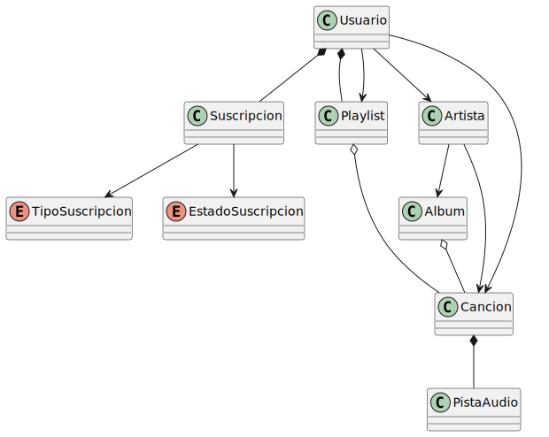
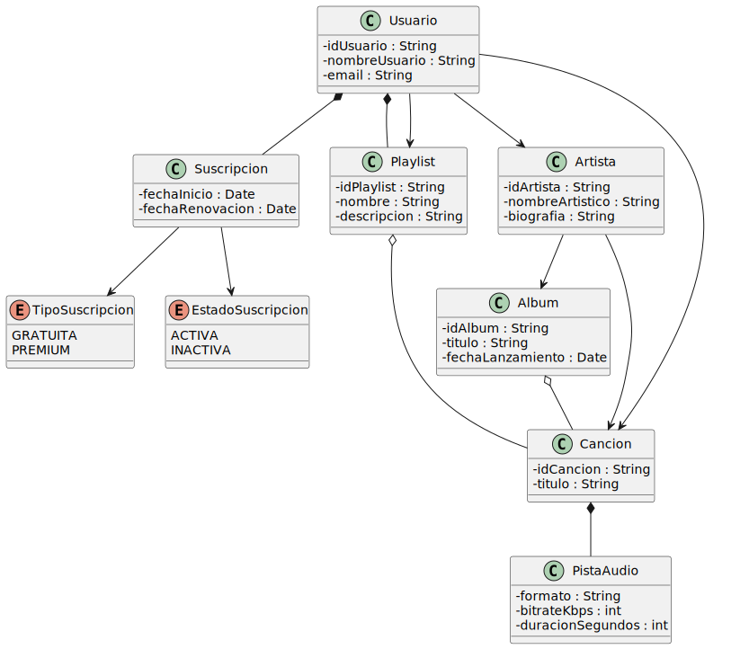

### Ecosistema Musical

<div align=center>

| Relación | Clases | Justificación |
|---|---|---|
| COMPOSICIÓN | Cancion y PistaAudio | La pista de audio no puede existir sin la canción y su ciclo de vida está ligado a ella |
| COMPOSICIÓN | Usuario y Suscripcion | Si el usuario desaparece del sistema, su registro de suscripción se destruye con él |
| COMPOSICIÓN | Usuario y Playlist | **(Listas creadas)** El usuario es el creador y dueño absoluto de la lista |
| | | Si el usuario elimina su cuenta, sus listas personalizadas se destruyen en cascada |
| AGREGACIÓN | Album y Cancion | Las canciones pueden existir independientemente del álbum (ej. lanzamientos como singles) |
| | | El álbum no crea las canciones, solo las agrega a su tracklist |
| AGREGACIÓN | Playlist y Cancion | La playlist simplemente agrupa canciones que ya existen en el catálogo general |
| | | Si se borra la playlist, las canciones siguen existiendo intactas en la plataforma |
| ASOCIACIÓN | Usuario y Playlist | **(Listas guardadas)** El usuario añade a su biblioteca listas creadas por terceros |
| | | Ambos objetos tienen ciclos de vida independientes; si el usuario se da de baja, la lista sobrevive |
| ASOCIACIÓN | Usuario y Cancion | **(Canciones favoritas)** El usuario guarda referencias directas a canciones que le gustan |
| | | Si el usuario elimina su cuenta, la canción sigue existiendo en el catálogo |
| ASOCIACIÓN | Usuario y Artista | Representa la acción de "seguir" a un artista |
| | | Es una relación duradera y estructural entre dos entidades con ciclos de vida independientes |
| ASOCIACIÓN | Artista y Cancion | Relación directa necesaria para modelar sencillos o colaboraciones |
| | | Permite que el artista se vincule a la canción sin depender obligatoriamente de un álbum |
| ASOCIACIÓN | Artista y Album | Relación estructural que modela la discografía del artista |
| | | Ambos mantienen identidades separadas y ciclos de vida independientes |

</div>

#### Diagrama de Clases



```java

enum TipoSuscripcion {
    GRATUITA, PREMIUM
}

enum EstadoSuscripcion {
    ACTIVA, INACTIVA
}

class PistaAudio {
    private String formato;
    private int bitrate;
    private int duracionSegundos;

    public PistaAudio(String formato, int bitrate, int duracionSegundos) {
        this.formato = formato;
        this.bitrate = bitrate;
        this.duracionSegundos = duracionSegundos;
    }
}

class Cancion {
    private String id;
    private String titulo;
    private PistaAudio pista; 
    
    public Cancion(String id, String titulo, String formatoPista, int bitrate, int duracion) {
        this.id = id;
        this.titulo = titulo;
        this.pista = new PistaAudio(formatoPista, bitrate, duracion); 
    }
}

class Album {
    private String titulo;
    private Date fechaLanzamiento;
    private List<Cancion> canciones;
    
    public Album(String titulo, Date fechaLanzamiento) {
        this.titulo = titulo;
        this.fechaLanzamiento = fechaLanzamiento;
        this.canciones = new ArrayList<>();
    }
 
    public void agregarCancion(Cancion cancion) {
        canciones.add(cancion);
    }
}

class Artista {
    private String nombre;
    private String biografia;
    private List<Album> albumesPublicados;
    private List<Cancion> sencillos;
    
    public Artista(String nombre, String biografia) {
        this.nombre = nombre;
        this.biografia = biografia;
        this.albumesPublicados = new ArrayList<>();
        this.sencillos = new ArrayList<>();
    }
    
    public void publicarAlbum(Album album) {
        albumesPublicados.add(album);
    }

    public void publicarSencillo(Cancion cancion) {
        sencillos.add(cancion);
    }
}

class Playlist {
    private String nombre;
    private String descripcion;
    private List<Cancion> canciones;
    
    public Playlist(String nombre, String descripcion) {
        this.nombre = nombre;
        this.descripcion = descripcion;
        this.canciones = new ArrayList<>();
    }
    
    public void anadirCancion(Cancion cancion) {
        canciones.add(cancion);
    }

    public void quitarCancion(Cancion cancion) {
        canciones.remove(cancion);
    }
}

class Suscripcion {
    private TipoSuscripcion tipo;
    private EstadoSuscripcion estado;
    private Date fechaInicio;
    
    public Suscripcion(TipoSuscripcion tipo) {
        this.tipo = tipo;
        this.estado = EstadoSuscripcion.ACTIVA;
        this.fechaInicio = new Date();
    }
    
    public void cancelar() {
        this.estado = EstadoSuscripcion.INACTIVA;
    }
}

class Usuario {
    private String nombreUsuario;
    private String email;
    private Suscripcion suscripcion;
    private List<Playlist> playlistsCreadas;
    private List<Playlist> playlistsGuardadas;
    private List<Artista> artistasSeguidos;
    private List<Cancion> cancionesFavoritas;
    
    public Usuario(String nombreUsuario, String email, TipoSuscripcion tipoSuscripcion) {
        this.nombreUsuario = nombreUsuario;
        this.email = email;
        this.suscripcion = new Suscripcion(tipoSuscripcion); 
        this.playlistsCreadas = new ArrayList<>();
        this.playlistsGuardadas = new ArrayList<>();
        this.artistasSeguidos = new ArrayList<>();
        this.cancionesFavoritas = new ArrayList<>();
    }

    public Playlist crearPlaylist(String nombre, String descripcion) {
        Playlist nuevaPlaylist = new Playlist(nombre, descripcion);
        playlistsCreadas.add(nuevaPlaylist);
        return nuevaPlaylist;
    }
    
    public void guardarPlaylistExterna(Playlist playlist) {
        if (!playlistsGuardadas.contains(playlist)) {
            playlistsGuardadas.add(playlist);
        }
    }
    
    public void marcarCancionFavorita(Cancion cancion) {
        if (!cancionesFavoritas.contains(cancion)) {
            cancionesFavoritas.add(cancion);
        }
    }

    public void seguirArtista(Artista artista) {
        if (!artistasSeguidos.contains(artista)) {
            artistasSeguidos.add(artista);
        }
    }
}

```

#### Diagrama de Clases con Atributos

