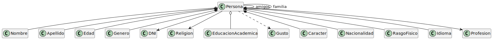

# Modelado de la identidad de una persona

## Elementos que tienen relacion con la identidad

- Nombre + Apellidos
- Edad
- Sexo
- Religión
- Educación
- Gustos
- Carácter
- Nacionalidad
- Apariencia física
- Idiomas
- Miembros de la familia
- Profesión

| Diagrama |
|-------|
| |
| [Código UML](modelosUML/dominio.puml)|
