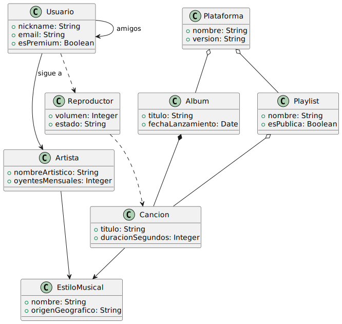

# Modelo del ecosistema musical

## Elementos que tienen relación con el ecosistema musical

- Canción
- Artista
- Álbum
- Estilo Musical
- Instrumento
- Plataforma (Spotify)
- Usuario
- Lista de Reproducción (Playlist)
- Reproductor
- Suscripción

| Diagrama |
|-------|
| |
| [Código UML](modelosUML/dominio.puml)|

## Relaciones del Modelo

|Relación|Clases|Justificación|
|-|-|-|
|**COMPOSICIÓN**|Álbum y Canción| Las canciones, como pistas de un álbum específico, mueren si el álbum desaparece del catálogo. Su existencia como parte de esa obra depende totalmente del álbum.|
|**COMPOSICIÓN**|Usuario y Suscripción| El estado de suscripción es un rasgo intrínseco del usuario en la plataforma. Si el usuario se elimina, su suscripción muere con él.|
|**AGREGACIÓN**|Plataforma y Álbum| La plataforma contiene álbumes, pero estos existen independientemente de ella (pueden estar en otras plataformas o formato físico).|
|**AGREGACIÓN**|Playlist y Canción| La lista de reproducción agrupa canciones, pero las canciones son independientes; si la lista se borra, la canción permanece en el sistema.|
|**AGREGACIÓN**|Plataforma e Idioma| Los idiomas disponibles en la interfaz de la plataforma existen independientemente de la existencia de la propia plataforma.|
|**ASOCIACIÓN**|Usuario y Artista| El usuario sigue a un artista. Es una relación duradera donde ambos coexisten de forma independiente.|
|**ASOCIACIÓN**|Usuario y Usuario| Los amigos en la red social de la plataforma mantienen un vínculo, pero cada persona es un ente independiente.|
|**ASOCIACIÓN**|Artista y Estilo| Un artista se asocia a un género musical para categorizarse, pero el género existe por sí solo en la cultura.|
|**ASOCIACIÓN**|Artista e Instrumento| El artista utiliza ciertos instrumentos de forma habitual en su carrera profesional.|
|**USO**|Reproductor y Canción| El reproductor hace uso esporádico de los datos de la canción para realizar la función de streaming.|
|**USO**|Usuario y Reproductor| El usuario utiliza los controles del reproductor (play, stop, volumen) ocasionalmente para interactuar con su música.|

