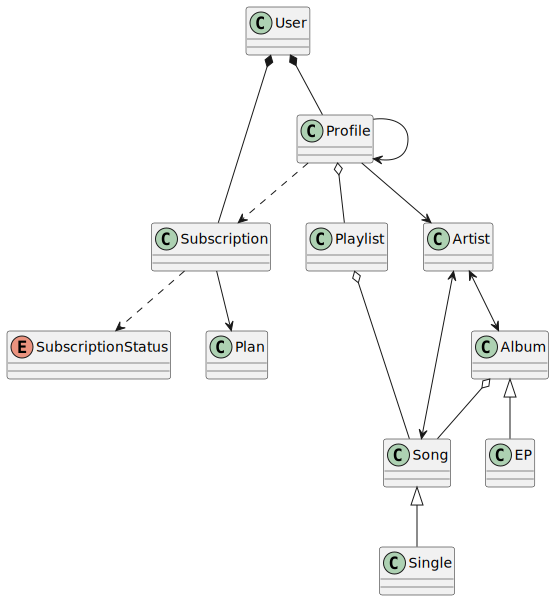
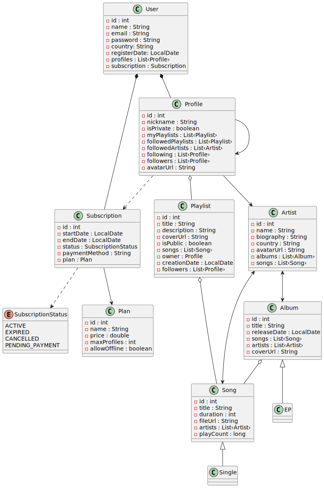

# Modelo de Dominio - Ecosistema Musical

## Descripción

Se presenta un resumen del modelo de dominio para un reproductor/plataforma musical en un contexto extendido. Este modelo incluye conceptos de usuarios, suscripciones, contenido musical y aspectos sociales.

## Modelo de Dominio

### Diagrama Extendido - Entidades con Atributos

### Componentes principales

- **Usuarios**: Entidades que interactúan con la plataforma
- **Perfiles**: Representación virtual del usuario dentro de la plataforma
- **Suscripción**: Sistema de membresía con diferentes planes
- **Contenido Musical**: Álbumes, canciones, EPs, Singles y Playlists
- **Artistas**: Creadores de contenido
- **Ámbito Social**: Interacciones entre perfiles y seguimiento de artistas 
