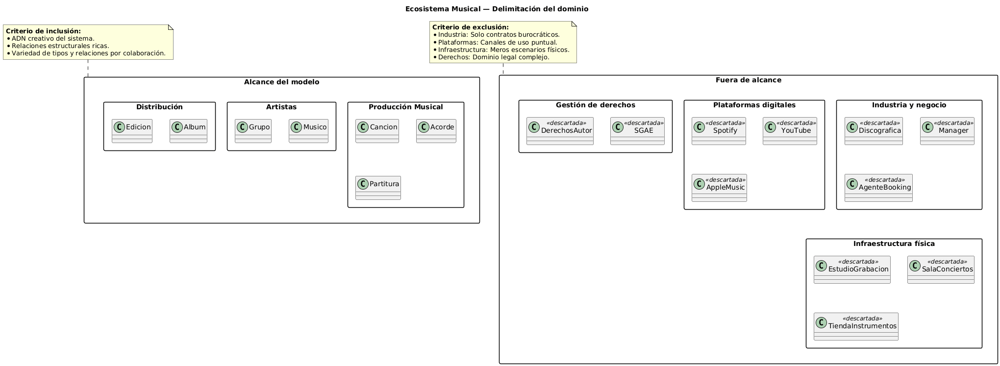

# Identificación de clases — Ecosistema Musical

## Delimitación del dominio

El ecosistema musical es un dominio amplio que abarca desde la creación artística hasta la gestión de derechos. Para este modelo, debemos decidir **qué incluimos y qué dejamos fuera**.

### Criterio de corte

Incluimos conceptos que nos permitan explorar los **4 tipos de relación por colaboración** (composición, agregación, asociación, uso) con justificaciones diferenciadas. Excluimos ámbitos que solo aportarían relaciones redundantes.

### Diagrama de delimitación

> Ver [delimitacionDominio.puml](../modelosUML/delimitacionDominio.puml)

El diagrama muestra visualmente los ámbitos que consideramos y la decisión de incluirlos o excluirlos.

### Ámbitos analizados

|Ámbito|Ejemplos|Incluido|Justificación|
|---|---|---|---|
|Producción musical|Canción, Acorde, Partitura|✅|Núcleo creativo del ecosistema. Aquí nacen las relaciones más ricas: composición entre la partitura y sus acordes, entre la canción y su partitura.|
|Artistas y agrupación|Músico, Grupo|✅|Aportan relaciones de agregación (grupo↔músico) y asociación (músico↔canción) que enriquecen el análisis.|
|Distribución|Álbum, Edición|✅|Permiten explorar agregación (álbum↔canciones) y composición (álbum↔ediciones), completando la variedad de relaciones.|
|Industria y negocio|Discográfica, Manager, Agente|❌|Relaciones contractuales/comerciales. Serían exclusivamente asociaciones, sin explorar nuevos tipos de relación.|
|Plataformas digitales|Spotify, YouTube, Apple Music|❌|Canales de distribución con relación de Uso puntual hacia las canciones. Redundante con relaciones ya cubiertas.|
|Infraestructura física|Estudio de grabación, Sala de conciertos|❌|Relaciones puramente de Uso. No aportan variedad al análisis de tipos de relación.|
|Gestión de derechos|SGAE, derechos de autor|❌|Dominio legal, no musical. Complejidad ajena al foco del ejercicio.|