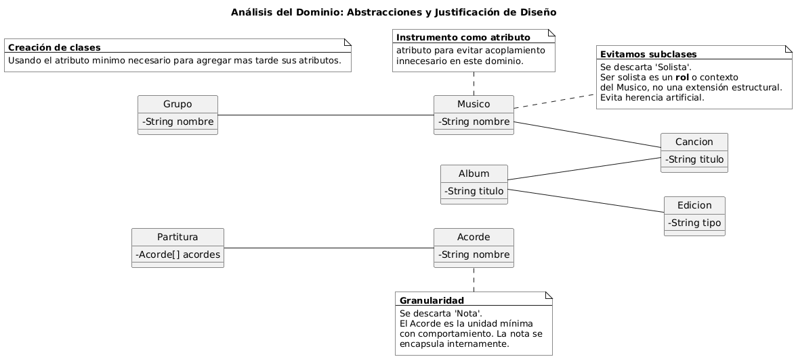

# Clases Candidatas

## Identificación de Abstracciones

En el proceso de modelado del sistema, hemos analizado el **dominio del problema** para identificar las entidades con la relevancia suficiente para ser tratadas como clases. Esta selección se basa en la identificación de **identidad, estado y comportamiento**, evitando tratar como clases lo que deberían ser simples atributos.

### Diagrama de clases

> Ver [clasesDominio.puml](../modelosUML/clasesDominio.puml)

El diagrama muestra visualmente las clases candidatas y sus relaciones.

A continuación, se presentan las abstracciones seleccionadas que capturan la lógica de negocio y aseguran una alta **cohesión**:

| Clase | Descripción | Justificación técnica: ¿Por qué es clase y no atributo? |
| :--- | :--- | :--- |
| **Cancion** | Pieza musical con metadatos de título y duración. | Es una **entidad central** con identidad propia. No es un dato primitivo; gestiona su propio estado y establece asociaciones con otras abstracciones. |
| **Acorde** | Combinación armónica de notas (ej: Do mayor). | Representa una unidad de **comportamiento y estructura**. Encapsula la lógica de su composición, evitando que el cliente deba conocer los detalles internos de las notas. |
| **Partitura** | Estructura que organiza la secuencia de acordes. | Se define como un **objeto compuesto**. Su responsabilidad es mantener la integridad de la relación de composición de los acordes en un orden determinado. |
| **Grupo** | Agrupación colectiva de músicos. | Es una entidad con ciclo de vida propio que gestiona una **agregación** de otras entidades (`Musico`). |
| **Musico** | Actor que interpreta o compone. | Posee identidad clara y participa en múltiples colaboraciones. Su estado y comportamiento son demasiado complejos para ser reducidos a una propiedad de otra clase. |
| **Album** | Colección cohesionada de canciones. | Funciona como un contenedor con identidad (título, año). Define un contexto de pertenencia y unidad de publicación. |
| **Edicion** | Variante específica de un álbum (vinilo, digital, etc.). | Se justifica como clase para gestionar la **variabilidad** del producto. Permite extender el sistema con nuevos tipos de soporte sin violar el principio de Abierto/Cerrado (OCP). |

## Descartes Justificados

Un diseño robusto requiere evitar la **sobre-ingeniería** y las jerarquías de herencia frágiles. Se han descartado los siguientes conceptos:

| Concepto | Motivo del descarte como clase |
| :--- | :--- |
| **Solista** | Se descarta para evitar una **herencia artificial**. Ser solista es un **rol** o un estado contextual de un `Musico`, no una especialización permanente. Aplicar `Solista extends Musico` podría violar el **Principio de Sustitución de Liskov (LSP)** si el comportamiento esperado cambia según el contexto del músico. |
| **Nota** | Se considera una cuestión de **granularidad**. En este modelo, el `Acorde` es la unidad mínima con comportamiento relevante. Modelar la `Nota` individual aumentaría la complejidad del sistema y el acoplamiento sin aportar nuevas relaciones de valor al análisis. |
| **Instrumento** | Aunque es relevante en la realidad, en nuestro modelo actual se trata como un atributo. Convertirlo en clase generaría una asociación pasiva que no explora nuevos comportamientos, manteniendo así el diseño más simple y enfocado. |