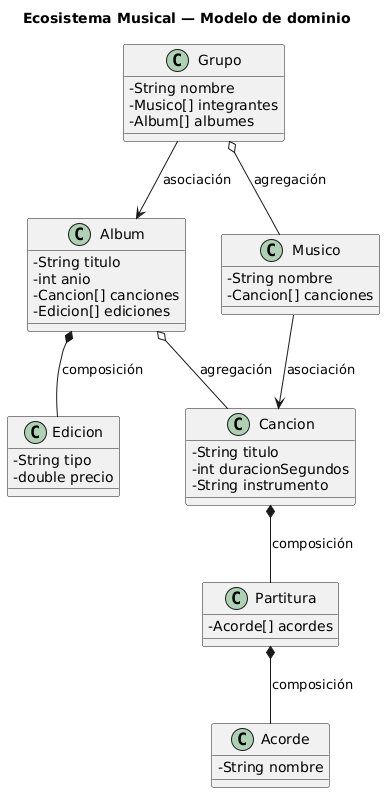

# Análisis de Relaciones: Ecosistema Musical

Para definir la arquitectura del sistema, aplicamos el criterio de la **relación más débil posible**. Evaluamos el acoplamiento entre abstracciones mediante las **3 preguntas de diseño** del repositorio:

1. **¿Quién controla el ciclo de vida?** (Control de existencia/instanciación).
2. **¿La relación es permanente o puntual?** (Visibilidad estructural vs. de uso).
3. **¿Es exclusiva o compartida?** (Posibilidad de múltiples referencias al mismo objeto).
---

## Modelo del Dominio

> Ver [modeloDominio.puml](../modelosUML/modeloDominio.puml)

---

## 1. Agregaciones (Acoplamiento Débil - Todo/Parte)

Relaciones donde el "Todo" contiene a la "Parte", pero mediante **Inyección de Dependencias**. Las partes mantienen su propia identidad.

### Album ◇—— Cancion
* **Ciclo de vida:** Independiente. La `Cancion` pre-existe al `Album` y sobrevive a su destrucción.
* **Temporalidad:** Permanente mientras dure la asociación en el catálogo.
* **Exclusividad:** Compartida. Una `Cancion` puede pertenecer a múltiples álbumes (Recopilatorios).

**Justificación:** Se elige **AGREGACIÓN**. Esto permite reutilizar objetos `Cancion` en diferentes contextos sin duplicar datos, reduciendo el acoplamiento.
**Implantación:** Las canciones se reciben como parámetros en el constructor de `Album`.

### Grupo ◇—— Musico
* **Ciclo de vida:** Independiente. El `Musico` (persona) existe fuera del `Grupo`.
* **Temporalidad:** Acotada (Dinamismo: los músicos entran y salen del grupo).
* **Exclusividad:** Compartida (Proyectos paralelos).

**Justificación:** Relación de **AGREGACIÓN**. El grupo es una agrupación de entidades independientes. El diseño debe permitir que un músico sea eliminado de un grupo sin ser borrado del sistema.
**Implantación:** Métodos `addMusico()` y `removeMusico()` que gestionan una colección de referencias.

---

## 2. Composiciones (Acoplamiento Fuerte)

En estas relaciones, el "Todo" tiene la **responsabilidad de instanciación**. La "Parte" es una entidad dependiente cuyo ciclo de vida está supeditado al contenedor.

### Partitura ◆—— Acorde
* **Ciclo de vida:** La `Partitura` crea y destruye sus `Acordes`. No tienen sentido semántico fuera de este contexto.
* **Temporalidad:** Permanente (Estructural).
* **Exclusividad:** Exclusiva. Un acorde en una posición específica de la partitura no se comparte.

**Justificación:** Se elige **COMPOSICIÓN** porque el acorde es una pieza constitutiva que nace con la partitura.
**Implantación:** Instanciación interna (`new`) dentro del constructor o métodos de `Partitura`.

### Cancion ◆—— Partitura
* **Ciclo de vida:** La `Cancion` es dueña de la `Partitura`. Si la canción desaparece, la partitura se destruye.
* **Temporalidad:** Permanente.
* **Exclusividad:** Exclusiva.

**Justificación:** La partitura no posee identidad independiente en este dominio. Sin la canción, el objeto `Partitura` carece de contexto.
**Implantación:** Atributo privado instanciado con `new` en el constructor de `Cancion`.

### Album ◆—— Edicion
* **Ciclo de vida:** El `Album` controla las `Ediciones`. Una edición (vinilo, digital) no existe sin un álbum de referencia.
* **Temporalidad:** Permanente.
* **Exclusividad:** Exclusiva.

**Justificación:** La edición es una especialización dependiente. Se aplica composición para asegurar la integridad referencial.
**Implantación:** Colección instanciada internamente en `Album`.

---

## 3. Asociaciones (Colaboración Funcional)

Es la relación más débil que implica conocimiento de estado entre pares sin jerarquía de contenido.

### Musico ——> Cancion
* **Ciclo de vida:** Totalmente independientes.
* **Temporalidad:** Duradera (Referencia de autoría o interpretación).
* **Exclusividad:** Compartida (N a N).

**Justificación:** **ASOCIACIÓN**. Representa una colaboración funcional ("Interpreta/Compone"). No hay una relación de "pertenencia" física, sino un vínculo lógico entre identidades fuertes.
**Implantación:** Referencia mediante atributos (punteros o IDs) sin responsabilidad de gestión de vida.

---

## Resumen de Decisiones de Diseño

| Par de Clases | Relación | Ciclo de Vida | Temporalidad | Exclusividad |
| **Album → Cancion** | **Agregación** | Independiente | Estructural | Compartida |
| **Grupo → Musico** | **Agregación** | Independiente | Variable | Compartida |
| :--- | :--- | :--- | :--- | :--- |
| **Partitura → Acorde** | **Composición** | Controlado | Permanente | Exclusiva |
| **Cancion → Partitura** | **Composición** | Controlado | Permanente | Exclusiva |
| **Album → Edicion** | **Composición** | Controlado | Permanente | Exclusiva |
| **Musico → Cancion** | **Asociación** | Independiente | Duradera | Compartida |

---
**Principios Aplicados:**
* **Bajo Acoplamiento:** Preferencia por Agregación/Asociación cuando la parte tiene identidad propia.
* **Alta Cohesión:** Cada clase gestiona únicamente las responsabilidades de su dominio.
* **Encapsulamiento:** Las composiciones protegen el estado interno de las partes dependientes.