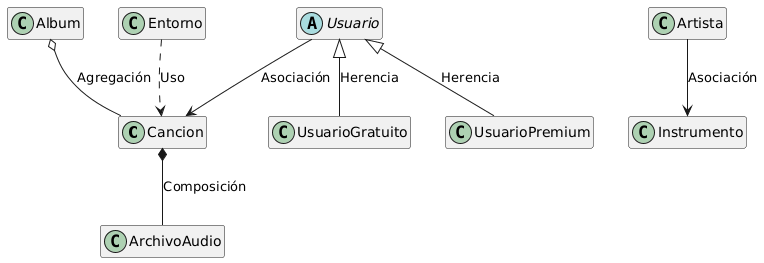

# Proyecto: Ecosistema Musical


### 1. Tabla de Relaciones

| Relación | Clases | Justificación |
| :--- | :--- | :--- |
| **COMPOSICIÓN** | `Cancion` y `ArchivoAudio` | El archivo de audio no puede existir sin la canción y su ciclo de vida está ligado a ella. Si se elimina la canción, el archivo se destruye. |
| **AGREGACIÓN** | `Album` y `Cancion` | Las canciones pueden existir independientemente del álbum (ej. como *singles*). El álbum no crea las canciones, solo las agrupa/agrega. |
| **ASOCIACIÓN** | `Artista` e `Instrumento` | Relación duradera donde el artista toca instrumentos específicos. El artista mantiene una referencia estructural al instrumento que domina o está tocando. |
| **USO** | `Entorno` y `Cancion` | El Entorno (ej. Spotify, Apple Music) utiliza temporalmente la canción solo para reproducirla mediante un método. No mantiene una referencia permanente a la canción después de la reproducción. |

---

### 2. Implementación en Código (Java)


```java
class Cancion {
    private String titulo;
    private ArchivoAudio pista; 
    private Estilo estilo; 
    
    public Cancion(String titulo, Estilo estilo, byte[] datosAudio) {
        this.titulo = titulo;
        this.estilo = estilo;
        this.pista = new ArchivoAudio(datosAudio); 
    }
    
    public String getTitulo() {
        return titulo;
    }
}

class ArchivoAudio {
    private byte[] datos;
    
    public ArchivoAudio(byte[] datos) {
        this.datos = datos;
    }
}

class Album {
    private String titulo;
    private List<Cancion> canciones; 
    
    public Album(String titulo) {
        this.titulo = titulo;
        this.canciones = new ArrayList<>();
    }
 
    public void agregarCancion(Cancion pista) {
        canciones.add(pista);
    }
    
    public void quitarCancion(Cancion pista) {
        canciones.remove(pista);
    }
}

class Artista {
    private String nombre;
    private List<Instrumento> instrumentos; 
    
    public Artista(String nombre) {
        this.nombre = nombre;
        this.instrumentos = new ArrayList<>();
    }
    
    public void asignarInstrumento(Instrumento instrumento) {
        instrumentos.add(instrumento);
    }
}

class Instrumento {
    private String tipo;
    
    public Instrumento(String tipo) {
        this.tipo = tipo;
    }
}

class Estilo {
    private String nombreGenero;
    
    public Estilo(String nombreGenero) {
        this.nombreGenero = nombreGenero;
    }
}

class Entorno {
    private String nombrePlataforma; 
    
    public Entorno(String nombrePlataforma) {
        this.nombrePlataforma = nombrePlataforma;
    }

    public void reproducirStream(Cancion cancion) {
        System.out.println(nombrePlataforma + " está reproduciendo temporalmente: " + cancion.getTitulo());
    }
}

```
---

## Iteración 2: Herencia y Usuarios


### 1. Nuevas Relaciones Añadidas

A la tabla de la Iteración 1, le sumamos las siguientes relaciones:

| Relación | Clases | Justificación |
| :--- | :--- | :--- |
| **HERENCIA** | `Usuario` (Padre) <br> `UsuarioPremium`, `UsuarioGratuito` (Hijas) | Los usuarios premium y gratuitos comparten atributos básicos (nombre), pero tienen comportamientos específicos (el premium puede descargar, el gratuito escucha anuncios). |
| **ASOCIACIÓN** | `Usuario` y `Playlist` | Un usuario puede crear y gestionar múltiples listas de reproducción. Es una relación estructural a largo plazo. |

---

### 2. Implementación en Código (Java) Actualizada

Añadimos las nuevas clases al código base para reflejar la herencia y las nuevas interacciones:

```java
import java.util.ArrayList;
import java.util.List;

class Cancion {
    private String titulo;
    private ArchivoAudio pista;
    public Cancion(String titulo, byte[] datos) { this.titulo = titulo; this.pista = new ArchivoAudio(datos); }
    public String getTitulo() { return titulo; }
}
class ArchivoAudio { private byte[] datos; public ArchivoAudio(byte[] datos) { this.datos = datos; } }
class Album { /* ... */ }
class Artista { /* ... */ }
class Instrumento { /* ... */ }
class Entorno { /* ... */ }


abstract class Usuario {
    protected String nombre;
    protected List<Cancion> favoritos; 
    
    public Usuario(String nombre) {
        this.nombre = nombre;
        this.favoritos = new ArrayList<>();
    }
    
    public void meGusta(Cancion cancion) {
        favoritos.add(cancion);
    }
    
    
    public abstract void escucharCancion(Cancion cancion);
}

class UsuarioGratuito extends Usuario {
    
    public UsuarioGratuito(String nombre) {
        super(nombre);
    }
    
    @Override
    public void escucharCancion(Cancion cancion) {
        System.out.println("Reproduciendo anuncio de 30 segundos...");
        System.out.println(this.nombre + " está escuchando: " + cancion.getTitulo());
    }
}

class UsuarioPremium extends Usuario {
    
    public UsuarioPremium(String nombre) {
        super(nombre);
    }
    
    @Override
    public void escucharCancion(Cancion cancion) {
        System.out.println(this.nombre + " está escuchando en alta calidad: " + cancion.getTitulo());
    }
    
    public void descargarCancion(Cancion cancion) {
        System.out.println("Descargando " + cancion.getTitulo() + " para escuchar offline.");
    }
}

```
---

### Diagrama de Relaciones de Clases

